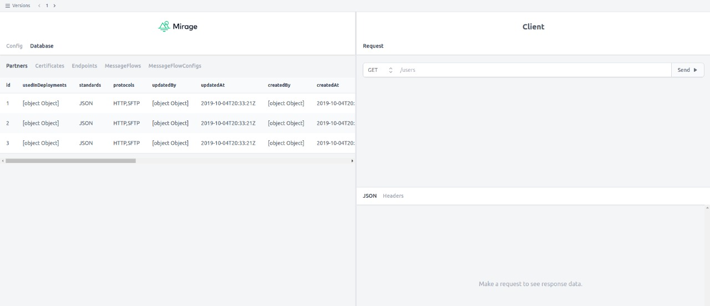
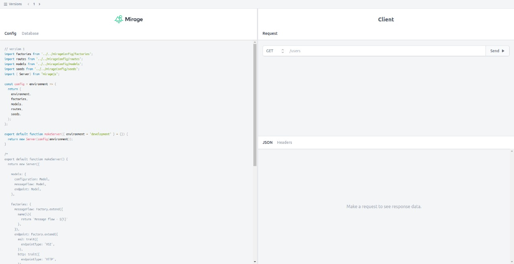

# Mirage b2b playground




This is a copy of ember mirage playground created for this training course

[→ View the training on YouTube](https://www.youtube.com/watch?v=lfDBb0Ar-rc)

## Running the playground on your computer

From a directory,

```sh
git clone git@github.com:azorzini/mirage-b2b-playground.git
cd mirage-b2b-playground
yarn install
ember s
```

## Credits to..

(@samselikoff or @ryanto) and the Ember Community
